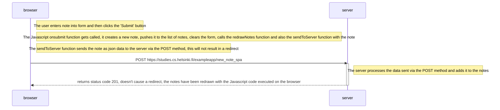

```mermaid
sequenceDiagram
    participant browser
    participant server

    Note right of browser: The user enters note into form and then clicks the 'Submit' button
    Note right of browser: The Javascript onsubmit function gets called, it creates a new note, pushes it to the list of notes, clears the form, calls the redrawNotes function and also the sendToServer function with the note 
    Note right of browser: The sendToServer function sends the note as json data to the server via the POST method, this will not result in a redirect

    browser->>server: POST https://studies.cs.helsinki.fi/exampleapp/new_note_spa
    activate server
    Note right of server: The server processes the data sent via the POST method and adds it to the notes
    server-->>browser: returns status code 201, doesn't cause a redirect, the notes have been redrawn with the Javascript code executed on the browser
    deactivate server
```
